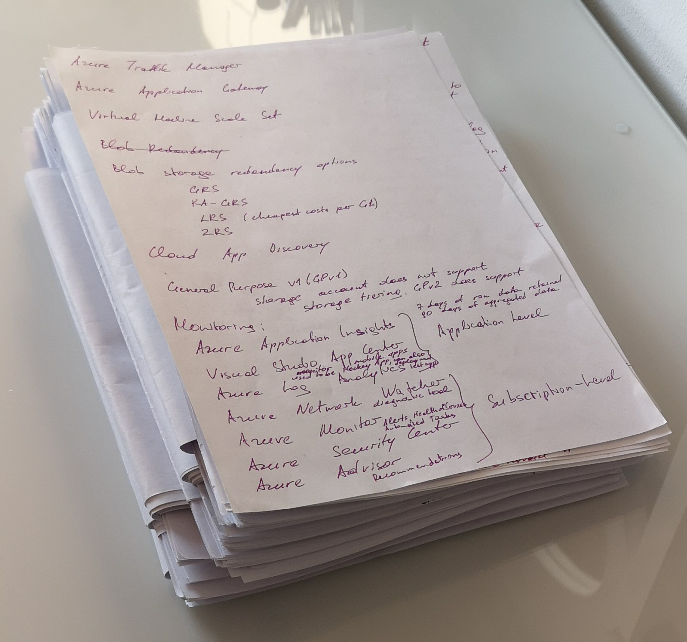
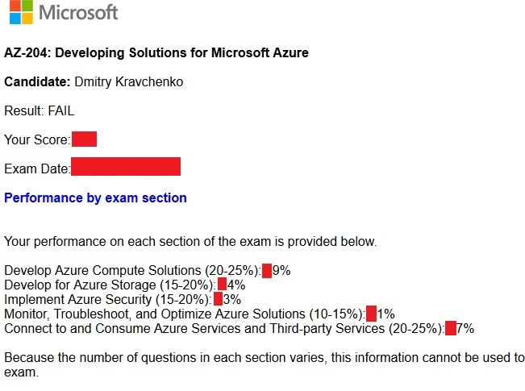

# Comparison of AWS Solution Architect (Associate) and Microsoft Azure Developer (Associate) certifications

In December 2020 author passed Microsoft Azure Developer Associate (AZ-204). About a year ago (November 2019) he also earned AWS Solution Architect Associate (SAA-C01*). In this article he would like to compare his experience with 2 certifications and answer the following questions
- Which certification was easy/more difficult to pass
- Which resources were used to prepare for both certifications
- Third party examination centers vs proctored examination
- Failing/retaking examination
- Re-validating policies
- What opportunity are there on the market with respect to earned certification

## Disclaimer 

Please be aware because of author’s location (Germany) and his background(.NET), he may be prone to some biases. Before starting to prepare for the Azure exam author had worked 6 months as Azure developer; on the other side AWS exam was passed without any prior practical experience. Also, as there is one year span between two examinations, author can recall more details about the most recent certification. In addition, a year ago COVID-19 did not exist and AWS Solution Architect Associate certification could only be taken at a third party certification center (as opposites to COVIS-19 era reality where exams by both providers can be taken in proctored mode). In addition, please note that two certifications have a slightly different focus (Azure does not have similar exam to AWS Solution architect; however, AWS has another certification (AWS Certified Developer – Associate/DVA-C01) that would be a better choice for comparison, these certificates can not be fully compared with each other. Lastly, both cloud providers keep changing their examination policies and after some time some statements in this article may not be entirely valid. After mentioning all possible sources of biases the above questions can be answered.

## Which certification was easy/more difficult to pass.

### AWS
When the author took AWS Solution Architect Associate exam, he thought it was actually a difficult test. The main challenge for the author was a time pressure or density of questions which one has to answer within given time. During the test author had a feeling he did not have enough time to think about possible solution for a given question: either one knows answer or one quickly guesses it and continues to the  next question –  there was not much time for reasoning and trying to eliminate wrong answers. As there are 65 questions for 130 minutes, one had 2 minutes per question and no time to review questions at the end of the exam or around 1,5 minute per question and 30 minutes to review the answers before submitting them. One useful tip for examination: As being not-native in English and taking examination in English one can get extra 30 minutes examination time via requesting exam accommodation. All questions were in a form of a case, where a problem description was given and a candidate needed to choose best fitting solution (in some cases several solutions). All questions were of the same nature. Almost all questions required solid understanding of main services with a fewer questions asking about specific peculiarities (something like which section does a template have, or which section does not exist in a template).

### Azure
Azure Developer Associate lasts 180 minutes and contains around 50 questions (author had slightly less, but he thinks at the beginning of the exam it was written that the number may slightly exceed 50). 180 minutes for an exam are fairly enough to answer all questions, but the grain of salt comes from a way how these questions are organized. All questions are divided into 3 groups of questions. Each section does not have time limitation for itself and one can spend as much time on a section, however, the entire time is limited to 180 minutes. Within 2 groups it is possible to review questions before finally submitting them. In the third group, where answers were of a type “Yes” or “No” type of questions (where a problem is described and a proposal was given, the task was to decided, whether the proposal solves a given problem), after answering a question, it is not possible to return back to it. The reason is that the next question will have the same problem, but will offer a different solution, and with the knowledge of a new proposed solution one may reconsider to change the answer in the previous question. In this group the author had slightly less than 10 questions and was given 2 problems: first problem with about 5 questions and second one also had about 5 questions. However, the biggest challenge was with a scenario based questions: a candidate is given information about one system, which has several components, requirements are described and there may be some bugs or issues with system. All this information is scattered among several tabs, and while answering a question you may need to click among all these tabs first in order to find the place(s) where relevant information for answer is. Author had two scenarios based question, with a bit less than 15 questions in total. What is variable is the time during the test when scenario based questions are asked: either at the beginning of the exam or at the end. The author experienced both options, which will be written about below. In regards to timing, the author needed 30 minutes per one scenario. Therefore for 2 scenarios – 1 hour in total is a good time allocation. For the remaining questions, the author had still 120 minutes in total, and after having answered all questions in slow pace within 90 minutes, the author still had 30 minutes to review them.

Also, the author wants to mention, that official Microsoft documents dos not exclude tasks that must be solved directly in Azure sandbox environment (i.e. either via Azure Portal, PowerShell or Azure CLI). And the author believes that indeed such tasks after some time in the future may be introduced into examination.

### Summary
As one can see already, that structure and organization of a question between two exams are different, the author assess Azure certification as being more difficult than AWS certification, as the former one has a different and a more complex structure of questions and often asks about specific syntax, SDK classes or variables in templates. As the author already mentioned in the beginning of the article, that this difference may partially come from different focuses of the exams (AWS Solution Architect vs Azure Developer). Summarizing experiences with two certifications,  the author thinks Microsoft Azure Developer Associate was more difficult than AWS Solution Architect Associate.

## Which resources were used to prepare for certifications

### AWS
For AWS Solution Architect Associate the author used Tutorials Dojo [1] and what is more or less the same course on Udemy [2]. The advantage of these resources is while going through the results of simulated tests one can read explanations why each proposed answer is wrong or right with references provided to official AWS documentation. These links were very helpful and useful during preparation. To check and solidify knowledge about certain services in the final phase of preparation the author also used official AWS FAQs. While going through each question in test simulation, the author made notes to questions and topics, which he did not know. Such notes were also useful to improve understanding of different services.

### Azure
For Microsoft Azure Developer Associate certification author used a course from Whizlabs [3] and a course on Udemy [4]. These 2 sources are more or less the same, partially overlapping and partially complimenting each other. Learning process with these resources was comparable with a preparation for AWS certification: each finished simulation test provides a short explanation why certain answer was right and provides a link to official documentation for further details. One important remark: both sources have a couple of wrong or contradictory answers, there are a couple of spelling and formatting errors and explanations are not always as thorough as Tutorials Dojo’s authors provided. Nevertheless, Whizlabs and Udemy were still very helpful and by far the best resources known to the author to get prepared for the examination. One resource which the author additionally used while learning for certification, was a Measure practice test course. Author’s opinions about this resource that its costs are too high for what it offers – i.e. simulation test experience is far away from how a real examination is. Also, the author finds organization of content of official Microsoft documentation was more complex than official AWS documentation: the author believes the intention by Microsoft was to provide the most comprehensive information to all possible groups of Azure users, however, it led to the result that during a learning phase the author had to search for the information through the whole documentation (i.e. “Quickstart”, “Tutorials”, “Concepts” and so on). During preparation the author also made notes about services  he did not know about and reread them before the examination. For both certifications the amount of notes was the same.

### Summary
In general. the experience during learning process for both certifications was similar.

## Third party certification centers vs proctored examination

### Certification centers
AWS Solution Architect Associate was taken at a certification center. What may happen while taking the exam in one of such centers is very difficult to predict. The author had the experience with 2 centers: one located in Munich and another in Frankfurt on Main (both in Germany). At the first center all people in the room where the testing was conducted were taking the same test and started at the same time. However, there was one candidate who made noise with a mouse in a way as if he was hammering nails with it into the table. For such cases the certification center provided headphones to cover the ears, however, the author got regular headphones (without noise canceling effect) and they were very old (so that the author even got his ears slightly dirty with headphones pad material as it basically started to decay from age). The certification center also provided ear plugs. However, they cause a pressure feeling inside the ears, that may destruct from focusing on the questions during the exam. What also was a strange experience is that certification center’s employee was not really engaged in giving the instructions before the examination, but rather did it because he had to follow his instructions without caring much about the exam’s candidates. At another certification center while the author was taking the  exam, the other people were brought to the room every now and then, who had their own certifications tests. The testing center’s employee gave them the instructions every time, which destructed the author from focusing on his exam. Although it was winter, air conditioner in the room was set to blowing mode, so the author had a cold wind blowing in his back during the examination. Therefore, the only advantages of the examination at a certification center are that one can take a break during the exam and go to a rest room (however, accompanied by a center’s employee) and also one can get a paper and a pencil for notes (i.e. to calculate number of IP addresses in a VPC), which must be returned at the end of exam. 

### PSI/Pearson VUE 
However, in respect to COVID-19 development, it became possible to have a proctored examination. There are two providers available: PSI and Pearson VUE.

### PSI
To get straight to the point: The author had a very bad experience with PSI.
The author did a  system check a couple of days before the examination date, to see whether the laptop passes all of the criteria. This test was successful, however, while proceeding through a check in before the real exam, the author got general messages, that some program was running and the test could not be started. It took some time to figure out that some background service was running and it  was stopped (if it matters they were Hyper-V processes). In total it caused about 30 minutes delay and therefore the author had 30 minutes less for a test from a given 180. Then shortly after the author started the exam, he was interrupted with the requirement to position his face to a certain place oval place on a screen within 4 minutes. However after about the first minute of these 4 minutes, the test was completely stopped, the author had to contact a proctor and redo check in or repeat some steps from the check-in. The author believes the reason of this interruption could be, that while proceeding with the check-in and taking a required selfie-photo, the author had no glasses on, and shortly before starting examination, the author put his glasses on. However, this is a guess without confirmations. But still it was not the last issue. Closer to the end, the author was interrupted again: a message was shown saying something about DNS issue. And the author had to contact the proctor again. All these experiences destructed and added significant stress and the author failed his first attempt. One more thing which is now funny, but during the test some workers arrived and started to drill a wall from outside in front of author’s apartment in order to install a balcony. The proctor heard them and asked what noise it was and warned me, that if any person enters the room, the test would be interrupted immediately, but allowed me to continue. After the exam ended, the author got an email from PSI with the result. What is important if this email was lost or deleted, there would be no any other chance to get the results again (PSI web site does not offer an option to resend/regenerate the score).

### Pearson VUE
Second attempt was scheduled with Pearson VUE. The author also did a system test a day before the examination date, on the examination date he repeated the test and he did not get any notifications in regards to Hyper-V processes (author did not do anything special to stop or uninstall them, and they should have been running in the background). However, the author experienced another issue, while uploading photos of ID with his mobile phone. The photos were not uploaded, the author believes it was because of a browser installed on the phone (it was Firefox). Therefore, one piece of advice is to make sure before the exam that there is more than one browser installed on a phone. As a workaround, the author switched quickly back to his laptop and took further photos with the laptop even if it was less convenient as taking photos with a mobile phone. One another important note: the author does not remember whether PSI also offered an option to take photos from a mobile phone and tends to think that this provider does not. The next criterion is difficult to assess, but the author believes Pearson VUE had better and friendlier usability than PSI. And the last advise for proctored examination independent from a provider: During one previous examination via Pearson VUE the author was asked to take away hands from his face and not to whisper/moving lips/read question for himself. Another difference by Pearson VUE is that after the examination is over it is always possible to download the exam result.

### Summary
Based on his experience, the author recommends to take proctored examination via Pearson VUE. In respect to Azure certification, the author had scenario based group of questions in the beginning of the test , during the test taken via Person VUE and in the end of test via PSI. These questions were the most difficult for the author, therefore he thinks it is better to have them in the beginning of the test, as during the exam the weariness will increase and towards the end it will be more difficult to answer these questions. However, the author can not be sure whether scenario based questions are always shown by Person VUE in the beginning and by PSI in the end of the test.

## Failing/retaking examination

The author had some exams which he passed from the first attempt, and some when he failed by taking them first time. Failing the exam is a bitter experience, however, almost everyone will be prepared already fairly well for the examination before taking it for the first time and therefore before repeating the examination second time, a candidate would not need to redo the same amount of learning as before the first attempt, but rather just to improve parts, which a candidate does not know good enough in addition to the other parts which are already mastered to a level sufficient to pass. Basically, one can compare it as running a marathon: the last kilometers are the most difficult, but it would be a pity to give up having behind already 2/3 of the distance.

## Re-validating policies

### AWS 
AWS Solution Architect Associate is valid for 3 years. Six month before the expiration date one can re-validate the exam for the next 3 years by taking the same test one more time.

### Azure
Microsoft Azure Developer Associate is valid only for 2 years. Six months before the certification expires, the renewal assessment can be completed online. After passing the renewal assessment, certification is extended by 1 additional year.

## What opportunity are there on the market with respect to earned certification

The author’s observation is that practical experience is more valued as certifications on the market. The later ones serve rather as a compliment to a resume. While negotiating a permanent position, the certification may strengthen a job seeker’s position indeed, for contract positions (freelance) a certification is less relevant.

Also the author tends to think, that companies that previously worked with Java/GO/Kotlin, choose AWS as their cloud provider, and companies that have affinity with .NET framework, choose Azure as their cloud solution. Therefore, while being a .NET developer it is easier to start working with Azure than with AWS and vise versa. There might be exceptions, but the author believes they are seldom.

### Notes:

[1] https://portal.tutorialsdojo.com/courses/aws-certified-solutions-architect-professional-practice-exams/

[2] https://www.udemy.com/course/aws-certified-solutions-architect-associate-amazon-practice-exams-saa-c02/

[3] https://www.whizlabs.com/microsoft-azure-certification-az-204/

[4] https://www.udemy.com/course/exam-microsoft-azure-dev/

* Version SAA-C01 is deprecated by March 2020, new version is SAA-C02
